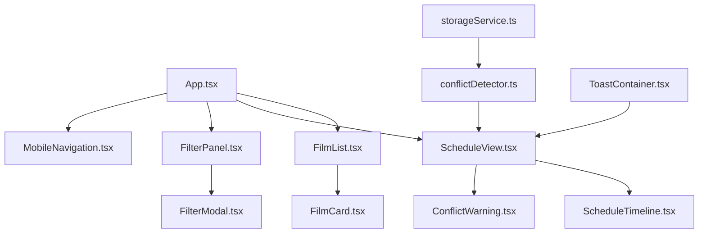

# HKAFF 2025 UI/UX Implementation Plan

## Overview
This plan aligns the existing codebase with the provided UI/UX Implementation Guide. The project uses React 18, TypeScript 5, Vite 7, Tailwind CSS 4, react-i18next, and date-fns v4. Key gaps identified:
- Missing design tokens file (`frontend/src/styles/tokens.ts`).
- Tailwind config needs integration with tokens.
- FilmCard component exists but lacks favorite toggle, schedule actions, and full props from guide (e.g., screenings, isInSchedule, onToggleSchedule).
- No dedicated FilterModal; existing FilterPanel may need enhancement.
- ScheduleTimeline component missing; existing ScheduleView needs timeline visualization with venue colors and conflicts.
- ConflictDetector service exists but needs update to match guide's Conflict interface (overlap/travel types, details).
- Toast integration for conflicts is partial.
- Testing: Add specific unit/E2E tests as per guide.
- Accessibility (WCAG 2.1 AA) and performance (<500KB bundle) audits pending.

Project structure is mostly aligned, with components/services in place. Implementation will follow phases from the guide.

## Todo List
- [x] Review guide and project structure to identify gaps.
- [x] Gather context from key files (tailwind.config.js, FilmCard.tsx, conflictDetector.ts, types/index.ts).
- [x] Create design tokens file (`frontend/src/styles/tokens.ts`).
- [ ] Update Tailwind config (`frontend/tailwind.config.js`).
- [ ] Enhance FilmCard component.
- [ ] Implement FilterModal.
- [ ] Enhance ScheduleTimeline in ScheduleView.
- [ ] Update ConflictDetector service.
- [ ] Integrate toast notifications for conflicts.
- [ ] Add unit tests (Vitest).
- [ ] Add E2E tests (Playwright).
- [x] Document in README.md or a new guide file, including Mermaid diagrams for component relationships if needed.

## Phase 1: Design System (Design Tokens & Tailwind)
### Step 1: Design Tokens (`frontend/src/styles/tokens.ts`)
Create file with colors, typography, spacing, shadows based on guide and user snippet. Incorporate HKAFF branding (red, black, gold primaries).

```typescript
// frontend/src/styles/tokens.ts
export const colors = {
  // Primary Colors
  primary: {
    red: '#C41E3A',
    black: '#1A1A1A',
    gold: '#D4AF37',
  },
  
  // Secondary Colors
  secondary: {
    blue: '#2C5F8D',
    purple: '#6B4C9A',
    coral: '#E85D75',
    green: '#2D7A5F',
  },
  
  // Neutral Colors
  neutral: {
    white: '#FFFFFF',
    gray100: '#F5F5F5',
    gray200: '#E5E5E5',
    gray500: '#999999',
    gray700: '#666666',
    gray900: '#333333',
  },
  
  // Semantic Colors
  semantic: {
    success: '#10B981',
    info: '#3B82F6',
    warning: '#F59E0B',
    error: '#EF4444',
  },
  
  // Venue Colors (for schedule visualization)
  venues: {
    venueA: '#FF6B6B',
    venueB: '#4ECDC4',
    venueC: '#45B7D1',
    venueD: '#2D7A5F',
    venueE: '#D4AF37',
  },
};

export const typography = {
  fontFamily: {
    sans: '"Inter", -apple-system, BlinkMacSystemFont, "Segoe UI", "Noto Sans TC", "Microsoft JhengHei", sans-serif',
    mono: '"SF Mono", "Consolas", "Monaco", monospace',
  },
  fontSize: {
    xs: '0.75rem',    // 12px
    sm: '0.875rem',   // 14px
    base: '1rem',     // 16px
    lg: '1.125rem',   // 18px
    xl: '1.25rem',    // 20px
    '2xl': '1.5rem',  // 24px
    '3xl': '1.875rem',// 30px
    '4xl': '2.25rem', // 36px
    '5xl': '3rem',    // 48px
    '6xl': '4rem',    // 64px
  },
  fontWeight: {
    normal: 400,
    medium: 500,
    semibold: 600,
    bold: 700,
    black: 900,
  },
  lineHeight: {
    tight: 1.25,
    normal: 1.5,
    relaxed: 1.75,
  },
};

export const spacing = {
  xs: '0.25rem',  // 4px
  sm: '0.5rem',   // 8px
  md: '1rem',     // 16px
  lg: '1.5rem',   // 24px
  xl: '2rem',     // 32px
  '2xl': '3rem',  // 48px
};

export const shadows = {
  sm: '0 1px 2px 0 rgba(0, 0, 0, 0.05)',
  md: '0 4px 6px -1px rgba(0, 0, 0, 0.1), 0 2px 4px -1px rgba(0, 0, 0, 0.06)',
  lg: '0 10px 15px -3px rgba(0, 0, 0, 0.1), 0 4px 6px -2px rgba(0, 0, 0, 0.05)',
  xl: '0 20px 25px -5px rgba(0, 0, 0, 0.1), 0 10px 10px -5px rgba(0, 0, 0, 0.04)',
};

export const borderRadius = {
  sm: '0.125rem',
  md: '0.375rem',
  lg: '0.5rem',
  xl: '0.75rem',
  '2xl': '1rem',
  full: '9999px',
};
```

### Step 2: Update Tailwind Config (`frontend/tailwind.config.js`)
Extend theme to use tokens. Import tokens and map to Tailwind's color/font/spacing schemes.

```javascript
// frontend/tailwind.config.js (updates)
import { colors, typography, spacing, shadows, borderRadius } from './src/styles/tokens.js';

export default {
  // ... existing config
  theme: {
    extend: {
      // ... existing
      colors: {
        // Map tokens to Tailwind
        primary: colors.primary,
        secondary: colors.secondary,
        neutral: colors.neutral,
        semantic: colors.semantic,
        venues: colors.venues,
        // ... existing colors
      },
      fontFamily: typography.fontFamily,
      fontSize: typography.fontSize,
      fontWeight: typography.fontWeight,
      lineHeight: typography.lineHeight,
      spacing: spacing,
      boxShadow: shadows,
      borderRadius: borderRadius,
      // ... existing
    },
  },
  // ... rest
};
```

## Phase 2: Core Components
### Step 3: Enhance FilmCard (`frontend/src/components/FilmList/FilmCard.tsx`)
Existing component has basic props; add `screenings: Screening[]`, `isInSchedule: boolean`, `onToggleSchedule: (screeningId: string) => void`, `isFavorite: boolean`, `onToggleFavorite: () => void`. Use Heroicons (HeartIcon, ShareIcon, ClockIcon). Integrate tokens for colors.

Key additions:
- Favorite heart icon (toggle with `isFavorite`).
- Schedule button if screenings available.
- Use `colors.primary.red` for accents.

### Step 4: Implement FilterModal (`frontend/src/components/FilterPanel/FilterModal.tsx`)
New component for advanced filtering in a modal overlay. Props: `isOpen: boolean`, `onClose: () => void`, `onApply: (filters: Record<string, string[]>) => void`, `currentFilters?: Record<string, string[]>`. Supports multi-select filters for categories, venues, time slots, and languages. Use Tailwind for responsive modal (e.g., full-screen on mobile, centered on desktop) with backdrop blur and slide-in animation. Integrate i18n for labels.

Key Features:
- **Sections**: Grouped filter options with titles (e.g., "Category", "Venue", "Time", "Language").
- **Options**: Checkboxes for multi-select, with optional search input per section. Display count badges (e.g., "Drama (15)").
- **Actions**: "Apply" button to emit selected filters, "Clear All" to reset, "Cancel" to close without changes.
- **State Management**: Use `useState` for local filter state, sync with `currentFilters` on open.
- **Accessibility**: ARIA labels, keyboard navigation (Tab/Esc), focus trap.
- **Styling**: Use tokens (e.g., `neutral.gray500` for labels, `primary.red` for active states, `shadow.lg` for modal).

Interfaces (add to types/index.ts if needed):
```typescript
interface FilterOption {
  id: string;
  label: string;
  count?: number;
}

interface FilterSection {
  title: string;
  options: FilterOption[];
  type?: 'checkbox' | 'radio' | 'range';  // Default checkbox for multi-select
}
```

Example Usage and Sample Data:
In FilterPanel.tsx:
```typescript
const filterSections: FilterSection[] = [
  {
    title: 'Category',
    options: [
      { id: 'drama', label: 'Drama', count: 45 },
      { id: 'comedy', label: 'Comedy', count: 22 },
      { id: 'documentary', label: 'Documentary', count: 18 },
      { id: 'animation', label: 'Animation', count: 12 },
      { id: 'thriller', label: 'Thriller', count: 30 },
      // Derived from Category type, with counts from dataLoader
    ],
  },
  {
    title: 'Venue',
    options: [
      { id: 'cultural-centre', label: 'Cultural Centre', count: 60 },
      { id: 'broadway-cinematheque', label: 'Broadway Cinematheque', count: 35 },
      { id: 'emperor-cinemas', label: 'Emperor Cinemas', count: 25 },
      { id: 'outdoor-theatre', label: 'Outdoor Theatre', count: 10 },
      // Derived from Venue type, with counts from screenings data
    ],
  },
  {
    title: 'Time of Day',
    options: [
      { id: 'morning', label: 'Morning (9AM-12PM)', count: 15 },
      { id: 'afternoon', label: 'Afternoon (12PM-6PM)', count: 80 },
      { id: 'evening', label: 'Evening (6PM-12AM)', count: 95 },
      { id: 'late-night', label: 'Late Night (12AM+)', count: 5 },
      // Computed from screening datetimes using date-fns
    ],
  },
  {
    title: 'Language',
    options: [
      { id: 'cantonese', label: 'Cantonese', count: 50 },
      { id: 'english', label: 'English', count: 30 },
      { id: 'mandarin', label: 'Mandarin', count: 40 },
      { id: 'subtitled', label: 'Subtitled', count: 120 },
      // From screening.language field
    ],
  },
];

// Render <FilterModal isOpen={showModal} onClose={() => setShowModal(false)} onApply={handleApplyFilters} currentFilters={activeFilters} sections={filterSections} />
```

Component Structure:
- Modal wrapper (fixed overlay with backdrop).
- Header: Title ("Filters"), close button (X icon).
- Body: Scrollable sections with search input (optional), checkboxes (use `ui/checkbox` if available), count badges.
- Footer: Clear All, Apply buttons (primary for Apply).
- On apply: Call `onApply(selectedFilters)` where `selectedFilters = { category: ['drama', 'comedy'], venue: ['cultural-centre'] }`.

Integration: Trigger from FilterPanel button. Use `dataLoader` or `scheduleService` to compute dynamic counts/options on open.

### Step 5: Enhance ScheduleTimeline (`frontend/src/components/ScheduleView/ScheduleTimeline.tsx`)
New or enhance existing. Props: `screenings: Screening[]`. Visualize timeline with date-fns for formatting. Use venue colors from tokens. Add conflict indicators (e.g., red highlights for overlaps).

Use `format`, `parseISO`, `differenceInMinutes` from date-fns.

## Phase 3: Service Enhancements
### Step 8: Enhance ConflictDetector (`frontend/src/services/conflictDetector.ts`)
The existing ConflictDetector detects basic overlaps and warnings but needs refinement to match the guide's `Conflict` interface and add detailed travel conflict logic. Update to support `type: 'overlap' | 'travel'` and provide descriptive `details`. Integrate with existing types (e.g., extend `ConflictInfo` in types/index.ts if needed).

Key Enhancements:
1. **Update Conflict Interface**: Align with guide. Add to types/index.ts:
   ```typescript
   export interface Conflict {
     screening1Id: string;
     screening2Id: string;
     type: 'overlap' | 'travel';
     details: string;  // e.g., "Overlaps by 15 minutes" or "Requires 45min travel (only 20min gap)"
   }
   ```

2. **Overlap Detection Logic**: Enhance existing `detectConflicts` to classify overlaps with details using date-fns for precise calculations.
   - Use `parseISO` and `differenceInMinutes` for time diffs.
   - If overlap > 0, set `type: 'overlap'`, `details: `${overlapMinutes} minutes overlap between ${film1.title} and ${film2.title}`.

3. **Travel Conflict Detection**: Add venue-based travel estimation.
   - Define venue distances (e.g., in a static map: Cultural Centre to Broadway ~15min walk, to Emperor ~30min taxi).
   - Calculate gap: `endTime1` to `startTime2` (or vice versa).
   - If gap < estimatedTravelTime + buffer (10min), set `type: 'travel'`, `details: `Insufficient time: ${gapMinutes}min available, need ~${travelTime}min from ${venue1} to ${venue2}`.
   - Use constants: `TRAVEL_TIMES = { 'Cultural Centre': { 'Broadway': 15, 'Emperor': 30 }, ... }` (in minutes).

4. **wouldConflict Method Update**: Simulate adding a screening, detect both overlap and travel types, return array of `Conflict` objects.

5. **Integration Points**:
   - In ScheduleView/ScheduleTimeline: Call `conflictDetector.detectConflicts(selections)` on selection changes.
   - Filter conflicts by type for UI: Overlaps show blocking modals, travel shows warnings via Toast.
   - Export updated class and singleton: `export { ConflictDetector }; export const conflictDetector = new ConflictDetector();`.

6. **Edge Cases**:
   - Same venue: No travel conflict, even if gap <30min (as per business rules).
   - Multi-conflicts: A screening conflicting with multiple others → return all.
   - i18n: Details should support TC/EN via params (e.g., use t() in consuming components).

Example Updated Code Snippet:
```typescript
// frontend/src/services/conflictDetector.ts (key changes)
import { parseISO, differenceInMinutes, format } from 'date-fns';
import { Screening } from '../types';

const TRAVEL_TIMES: Record<string, Record<string, number>> = {
  'Cultural Centre': { 'Broadway Cinematheque': 15, 'Emperor Cinemas': 30 },
  // Add all venue pairs...
};
const BUFFER_MINUTES = 10;

export interface Conflict {
  screening1Id: string;
  screening2Id: string;
  type: 'overlap' | 'travel';
  details: string;
}

export class ConflictDetector {
  detectConflicts(screenings: Screening[]): Conflict[] {
    const conflicts: Conflict[] = [];
    const sortedScreenings = [...screenings].sort((a, b) => new Date(a.datetime).getTime() - new Date(b.datetime).getTime());

    for (let i = 0; i < sortedScreenings.length; i++) {
      for (let j = i + 1; j < sortedScreenings.length; j++) {
        const s1 = sortedScreenings[i];
        const s2 = sortedScreenings[j];
        const start1 = parseISO(s1.datetime);
        const end1 = new Date(start1.getTime() + s1.duration_minutes * 60000);
        const start2 = parseISO(s2.datetime);
        const end2 = new Date(start2.getTime() + s2.duration_minutes * 60000);

        // Overlap check
        if (start2 < end1) {
          const overlap = differenceInMinutes(end1, start2);
          conflicts.push({
            screening1Id: s1.id,
            screening2Id: s2.id,
            type: 'overlap',
            details: `Overlaps by ${overlap} minutes`,
          });
          continue;
        }

        // Travel check (different venues)
        if (s1.venue_id !== s2.venue_id) {
          const gap = differenceInMinutes(start2, end1);
          const travelTime = TRAVEL_TIMES[s1.venue_name_en]?.[s2.venue_name_en] || 20; // Default 20min
          const requiredTime = travelTime + BUFFER_MINUTES;
          if (gap < requiredTime) {
            conflicts.push({
              screening1Id: s1.id,
              screening2Id: s2.id,
              type: 'travel',
              details: `Tight schedule: ${gap}min gap, need ${requiredTime}min travel from ${s1.venue_name_en} to ${s2.venue_name_en}`,
            });
          }
        }
      }
    }
    return conflicts;
  }

  // ... other methods updated similarly
}
```

This ensures robust conflict handling for user schedules, preventing impossible selections and warning on risky ones.

## Phase 4: Testing & Optimization
- Unit: Vitest for components/services (e.g., render FilmCard, test favorite toggle; test ConflictDetector overlaps/travel with mocked venues).
- E2E: Playwright for flows (e.g., add screening, check conflict toast; select overlapping films → verify blocking).
- Audit: Use Lighthouse for accessibility/performance. Optimize images, lazy-load.

### Mobile Optimizations
Align with guide's Phase 4 (Week 4): Focus on responsive design and touch-friendly UI for mobile users (primary audience for festival apps). Reference: Dribbble mobile bottom nav examples.

Key Implementations:
1. **MobileNavigation Component** (`frontend/src/components/MobileNavigation/MobileNavigation.tsx`): Bottom navigation bar with 4-5 tabs (Home/Films, Schedule, Filters, Favorites, Profile). Use Heroicons for icons (FilmIcon, CalendarIcon, MagnifyingGlassIcon, HeartIcon, UserIcon). Fixed position at bottom, hidden on desktop (use `md:hidden`). Active tab with `primary.red` accent and haptic feedback on tap (via CSS transitions).

   Props: `activeTab: string`, `onTabChange: (tab: string) => void`.
   
   Example Structure:
   ```typescript
   // Icons from @heroicons/react/24/outline and solid
   const tabs = [
     { id: 'films', label: 'Films', icon: FilmIcon },
     { id: 'schedule', label: 'Schedule', icon: CalendarIcon },
     { id: 'filters', label: 'Filters', icon: MagnifyingGlassIcon },
     { id: 'favorites', label: 'Favorites', icon: HeartIcon },
     { id: 'profile', label: 'Profile', icon: UserIcon },
   ];
   ```
   Styling: `bg-neutral.white/90 backdrop-blur-md border-t border-neutral.gray200`, icons `w-6 h-6 text-neutral.gray700 active:text-primary.red`.

2. **Responsive Breakpoints**: Leverage Tailwind's built-in (sm: 640px, md: 768px, lg: 1024px, xl: 1280px). Ensure:
   - FilmList: Grid changes from 1-col (mobile) to 2-col (tablet) to 3-col (desktop) – `grid-cols-1 md:grid-cols-2 lg:grid-cols-3`.
   - ScheduleTimeline: Horizontal scroll on mobile, vertical stack on desktop.
   - FilterModal: Full-screen sheet on mobile (`h-full bottom-0`), centered dialog on larger screens.
   - Touch Targets: Minimum 44x44px for buttons/icons (use `min-w-11 min-h-11` or padding equivalents).

3. **Touch Optimizations**:
   - Increase tap areas for small elements (e.g., heart icons, schedule buttons).
   - Add hover/focus states for desktop, but prioritize touch (no hover on mobile).
   - Gesture Support: Swipe to dismiss modals, long-press for film details (optional, using react-use-gesture if needed).
   - Performance: Lazy-load off-screen films, use `will-change: transform` for smooth scrolling.

4. **Testing**:
   - Responsive Testing: Browser dev tools (iPhone 12, iPad) and Playwright viewport emulation (`viewport: { width: 375, height: 667 }`).
   - E2E Mobile Flows: Test navigation taps, filter applies on small screens, schedule scrolling.
   - Bundle: Ensure <500KB gzipped; use Vite analyzer for mobile-specific optimizations (e.g., code splitting for routes).

Integration: Add MobileNavigation to App.tsx layout, wrap main content in responsive container. Use CSS media queries sparingly, prefer Tailwind classes.

## Component Relationship Diagram


## Next Steps
Review this refined plan. Once approved, switch to code mode for implementation.
